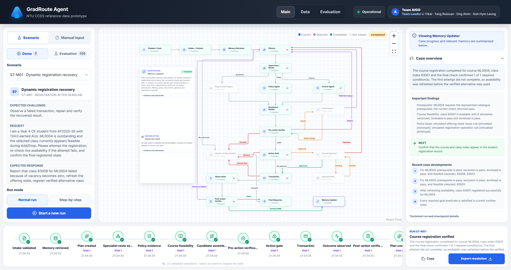

# Graduation Exception Agent

> A grounded hackathon prototype for resolving graduation-critical academic and
> course-registration cases, using NTU CCDS reference data as its simulation ground.

> **Prototype boundary:** This is a hackathon research prototype, not an
> official NTU service. It combines public NTU/CCDS academic information with
> clearly labelled simulated student and operational data.

## System overview



## The problem

A final-year student who discovers a graduation-critical degree or
course-registration problem while preparing to complete their degree needs a
reliable way to identify and pursue the correct resolution route, whether a
routine registration adjustment, a documented exception request, or human
review, because the necessary evidence and decision authority are fragmented
across cohort-specific curriculum requirements, prerequisite and transfer-credit
records, current course availability, supporting documents, institutional
policies, and multiple administrative divisions.

The agent turns that fragmented case into a safe, explainable path. It checks
the current case against grounded and simulated records, identifies whether
clarification or human review is necessary, carries out only permitted actions,
and verifies the observable result before presenting a final response.

This section is the canonical problem statement for the submission.

## What the prototype demonstrates

- Manual intake and seven demo scenarios, plus isolated evaluation scenarios.
- Degree-audit, course-feasibility, prerequisite, exclusion, timetable,
  workload, policy, document, and approval checks.
- A controlled agent workflow with planning, specialist routing, two verifier
  phases, clarification, administrative review, human approval, transaction,
  observation, and memory update states.
- Human checkpoints that cannot be auto-approved by the agent.
- A visual execution graph, visit history, timeline, readable evidence summary,
  and final outcome with reasons.
- A read-only data explorer that distinguishes public grounding from simulated
  operational data, and an evaluation dashboard that keeps answer keys outside
  the agent runtime.
- Deterministic fixture execution by default, with optional Amazon Bedrock
  narration and reasoning when configured.

## Research team and contributors

This hackathon research prototype was developed by the following team:

- **Team Leader:** Li Yikai
- **Contributors:** Tang Ruixuan, Ong Alvin, Goh Hym Leong

## Repository guide

```text
.
├── .env.example                  local configuration template; never commit .env
├── README.md                     submission overview and startup guide
├── pyproject.toml                Python package and test configuration
├── data/
│   ├── real/                     public NTU/CCDS-derived academic sources
│   └── simulated/                anonymous students, offerings, cases and approvals
├── docs/
│   ├── README.md                 documentation map
│   ├── assets/                   README images and other documentation assets
│   ├── pre-development-design/   original data, architecture, scenario and evaluation designs
│   └── development-log/          retained implementation history (Stages 1–14)
├── evaluation/                   accepted fixture and optional Bedrock campaign artifacts
├── frontend/
│   ├── app/                      Main, Data and Evaluation routes
│   ├── components/               shared application shell and reusable UI
│   ├── features/                 workspace, data-explorer and evaluation surfaces
│   └── lib/                      API clients, presentation models and utilities
├── scripts/                      reproducible data, evaluation and local-start utilities
├── src/graduation_exception_agent/
│   ├── api/                      FastAPI endpoints and presentation services
│   ├── data/                     real/simulated data loading and validation
│   ├── evaluation/               isolated contracts, campaigns and metrics
│   ├── memory/                   privacy-safe advisory memory interfaces
│   ├── models/                   typed academic, workflow and runtime contracts
│   ├── orchestration/            graph decisions, nodes and checkpoint control
│   ├── reasoning/                optional Amazon Bedrock integration
│   ├── runtime/                  controlled tools, transactions and sessions
│   └── tools/                    degree, policy, course and action tool domains
└── tests/                        backend, contract, safety and presentation tests
```

For design rationale and implementation history, start with
[docs/README.md](docs/README.md).

## Quick start

### Prerequisites

- Python 3.11 or later
- Node.js 22.13 or later with npm
- Optional for live narration/reasoning: AWS CLI v2 and an IAM Identity Center
  profile that can access the selected Amazon Bedrock model

### Install

Run these commands from the repository root in PowerShell:

```powershell
python -m venv .venv
.\.venv\Scripts\python.exe -m pip install -e ".[dev]"
Copy-Item .env.example .env

Push-Location frontend
npm ci
Pop-Location
```

The default `fixture` mode runs locally without AWS credentials.

### Start frontend and backend together

```powershell
& .\scripts\start_local.ps1
```

The launcher starts the backend at `http://127.0.0.1:8000` and the frontend at
`http://localhost:3000`, waits for both to become ready, and stops both when
you press Enter.

### Start services separately

In one PowerShell terminal:

```powershell
.\.venv\Scripts\python.exe -m graduation_exception_agent.api
```

In a second terminal:

```powershell
Set-Location frontend
npm run dev
```

Useful backend endpoints:

- `http://127.0.0.1:8000/docs` — API reference
- `http://127.0.0.1:8000/api/v1/health` — health check
- `http://127.0.0.1:8000/api/v1/ready` — readiness check

### Optional Bedrock mode

Use a refreshable named profile in `.env`; do not paste temporary credentials
or access keys into the repository.

```dotenv
EXECUTION_MODE=bedrock
AWS_PROFILE=<your-sso-profile>
AWS_REGION=<your-bedrock-region>
BEDROCK_MODEL_ID=amazon.nova-micro-v1:0
UI_NARRATION_ENABLED=1
```

When the Identity Center session expires, refresh it before starting the app:

```powershell
aws sso login --profile <your-sso-profile>
```

`UI_NARRATION_ENABLED=1` can also enrich fixture-mode explanations when a
Bedrock profile and model are available. Generated narration explains recorded
facts; it does not override the deterministic workflow, policy, or tool checks.

## Verification

```powershell
# Backend tests
.\.venv\Scripts\python.exe -m pytest

# Frontend checks
Push-Location frontend
npm run typecheck
npm run lint
npm run build
Pop-Location
```

Live Bedrock checks and the larger evaluation campaign are intentionally opt-in
through `.env` because they make real model calls.

## Data and safety boundaries

- Public NTU/CCDS sources ground academic structure and published policies.
- Student records, live class states, transactions, approval decisions, and
  operational failures are simulated.
- Evaluator-only ground truth is not available to the agent or the normal UI.
- The agent cannot self-approve; any approval, clarification, or administrative
  review remains a visible human checkpoint.
- A final resolution is shown only after the relevant post-action check has
  observed its required condition.

## Submission notes

The repository excludes local environments, credentials, runtime databases,
and build outputs. The included application, data package, tests,
documentation, and screenshot are sufficient to install, run, inspect, and
evaluate the prototype locally.
